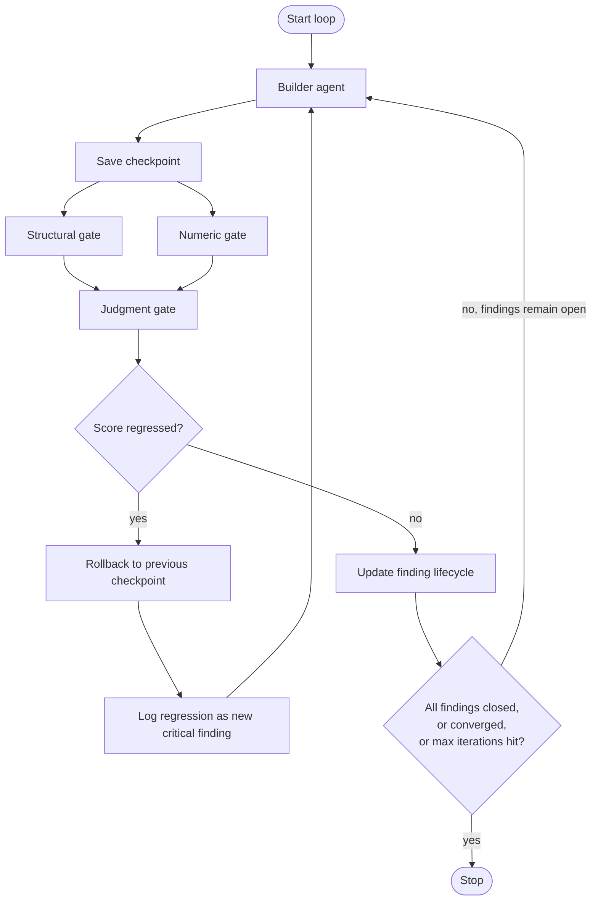

# Ratchet

A Claude Code / MiMoCode skill for running iterative build-verify loops that only move forward — never backward, never re-litigated once a finding is genuinely closed.

## What it does

Ratchet orchestrates a **build → verify → fix** cycle where findings only move forward, checkpoints protect against regressions, and the builder's feedback shrinks every round instead of growing.



Note the rollback edge: a regressed score routes **back to a previous checkpoint and back to the builder** — it never routes forward into "save checkpoint." That distinction matters; the whole point of rollback is to stop building on top of a worse state.

Core mechanics:

- A **builder** subagent implements or fixes code.
- **Verifiers** check the result across three distinct gate types — structural (what did this change touch), numeric (does it pass measurable thresholds), and judgment (does this still make sense, is there a subtle bug).
- Every finding carries **severity** and **confidence**, not just pass/fail.
- Findings move through a fixed lifecycle — `Open → Fixed → Verified → Closed` — so nothing is trusted as resolved until it survives a second clean pass.
- Each iteration's feedback to the builder contains **only what's still open** — resolved findings are never resent.

Full schemas and gate definitions live in [`SKILL.md`](./SKILL.md); this README covers the shape of the loop, not the spec.

## Why

Most agent build-verify loops look like:

```
Builder → Reviewer → Builder → Reviewer → ...
```

This tends to produce context drift, repeated findings, hallucinated "looks good" approvals, and prompts that grow every iteration instead of shrinking. Ratchet exists to fix the specific failure modes that cause that:

- **A subagent grading a number it could have just computed.** If a check can be written as `f(output) → bool`, it's run as code — not judged by an LLM that might round favorably or talk itself into a pass.
- **Regressions slipping through silently.** The numeric gate re-runs the full suite every iteration, not just the previously-failing check, so a fix that reintroduces an old bug gets caught automatically.
- **No trust distinction between "passed once" and "actually resolved."** The `Fixed → Verified` step exists because a finding that passed by luck (flaky test, marginal metric) shouldn't be closed on the same footing as one that's held for two consecutive passes.
- **One bad iteration compounding.** Checkpoints + rollback stop the loop from building on top of a worse state.
- **Growing, unfocused feedback.** Only non-closed findings are ever sent back to the builder.

## Installation

Drop the skill file into your project's skills directory:

```
your-project/
└── .claude/
    └── skills/
        └── ratchet/
            └── SKILL.md
```

No dependencies beyond what your agent runtime already provides (subagent spawning + bash/script execution). A code-graph/dependency MCP tool (e.g. codemap, Sourcegraph) improves the structural gate but isn't required — see [Structural check fallback](#structural-check-fallback) below.

## Usage

Invoke it naturally in conversation, or via a slash command if your setup supports it:

```
/ratchet "add volume_profile() feature and validate against backtest thresholds"
```

Trigger phrases the skill responds to: *"loop until it passes,"* *"iterate until the backtest/tests/build succeeds,"* *"build-verify loop,"* *"keep fixing until it passes."*

Before the loop starts, define (once, explicitly — never mid-loop):

- **Numeric thresholds** — the pass/fail criteria for your metric(s).
- **Convergence parameters** — `ε` (minimum meaningful improvement) and `N` (consecutive iterations below `ε` before stopping).
- **Max iterations** — the hard cap.

## Checkpoints

Each iteration's checkpoint is saved before verification runs, named by iteration (`chk_iter_01`, `chk_iter_02`, ...). Rollback restores the most recent checkpoint with a non-regressed score — see the diagram above for where that fits in the loop.

A full worked example with real scores, findings, and the exact lifecycle transitions per iteration is in [`SKILL.md`](./SKILL.md#worked-example) — not duplicated here, so the two files don't drift out of sync as the spec evolves.

## Structural check fallback

The structural gate degrades gracefully depending on what's available in your environment:

```
1. Dependency graph / code-graph MCP (codemap, Sourcegraph)  — most reliable
2. Git diff analysis
3. AST analysis
4. Manual review (logic verifier reads the diff directly)   — least reliable
```

The level actually used is logged in the loop's state file, so downstream confidence scoring can account for it.

## Scope — what this is *not*

- **Not a parallel-build orchestrator.** If you need multiple builders working simultaneously on different modules, Ratchet governs each builder's own verify cycle, but the merge/integration layer between them needs separate orchestration.
- **Not for pure subjective work.** If there's no measurable or structurally-checkable gate at all (e.g. pure creative writing), a single builder + single reviewer pass is enough — Ratchet's state tracking and checkpointing add process without benefit there.

## File structure

```
ratchet/
├── SKILL.md    # the skill definition — full spec, schemas, and workflow
└── README.md   # this file
```

## License

No `LICENSE` file included yet. Add one (MIT is the common default for skill repos like this) before treating this as open for reuse — until then, standard copyright applies by default.
